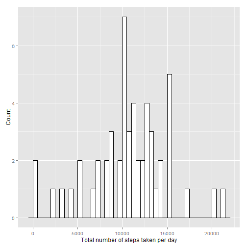
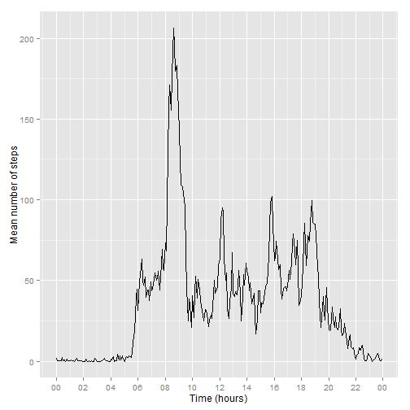
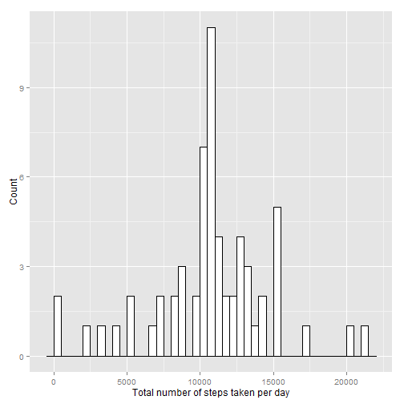
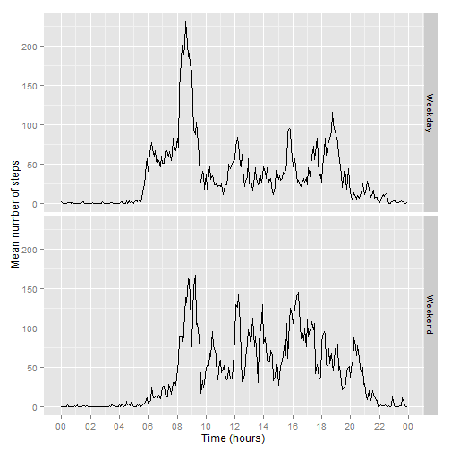

## 1. Loading and preprocessing the data

### Loading original data

```r
setwd("~/Coursera/Data")
act <- read.csv("activity.csv")
```

### Change interval in a time format to produce time amd timestamp

```r
library(lubridate)
library(stringr)
act$interval <- as.character(act$interval)
act$interval <- str_pad(act$interval, width=4, side = "left", pad = "0")
act$hour <- str_sub(act$interval,start = 1, end = 2)
act$min  <- str_sub(act$interval,start = 3, end = 4)
act$time <- paste(act$hour,act$min,sep=":")
act$date <- as.character(act$date)
act$ts <- paste(act$date,act$time)
act$time <- as.factor(act$time)
```


## 2. Creating a histogram and calculating the  mean total number of steps taken per day

### Filtering out the NA's and grouping by date

```r
library(dplyr)
acthist <- filter(act, !is.na(act$steps))
acthist <- acthist %>% group_by(date) %>% summarise(sum = sum(steps))
```

### Plot a histogram of the total number of steps taken each day

```r
library(ggplot2)
library(scales)
histplot<-ggplot(acthist, aes(sum)) + geom_histogram(binwidth=500, colour="black", fill="white") + xlab("Total number of steps taken per day") + ylab("Count")
plot(histplot)
```

 

### Obtain the mean and the median

```r
mean <- summarise(acthist, avg = mean(sum))
median <- summarise(acthist, med = median(sum))
mean <- as.integer(mean)
```
#### The mean is 10766 the median is 10765


## 3. Explore the day pattern

### Change all the dates in 2012-01-01 (arbitrary date), group by timestamp 

```r
actday <- filter(act, !is.na(act$steps))
actday$date = "2012-01-01"
actday$ts <- paste(actday$date,actday$time)
actday <- actday %>% group_by(ts) %>% summarise(mean = mean(steps))
actday$ts <- as.POSIXlt(actday$ts)
actday$time <- as.factor(strftime(actday$ts, format="%H:%M"))
```
### plot the mean numer of steps versus time

```r
dayplot <- ggplot(actday, aes(ts, mean)) + geom_line() + xlab("Time (hours)") + ylab("Mean number of steps")
dayplot <- dayplot + scale_x_datetime(breaks = date_breaks("2 hour"), minor_breaks=date_breaks("1 hour"), labels=date_format("%H"))
plot(dayplot)
```

 

### Indentify the 5 minute interval that on average contains the maximum number of steps

```r
max <- max(actday$mean)
maxtime <- actday$time[which(actday$mean == max)]  
```
####  On average, across all the days in the dataset, the 5 minute interval 08:35 contains the maximum number of steps.


## 4. Imputing missing values

### Calculate and report the total number of missing values in the dataset 

```r
actNA <- filter(act, is.na(act$steps))
numbermissing <- nrow(actNA)
```
#### The total number of missing values is 2304

### The strategy for filling in all of the missing values in the dataset is using the mean number of steps for that 5-minute interval

```r
actNA$ts <- as.POSIXlt(actNA$ts)
for(i in 1:nrow(actNA)){ 
        actNA$steps[i] <- actday$mean[which(actday$time == actNA$time[i])]
} 
actA <- filter(act, !is.na(act$steps))
actA$ts <- as.POSIXlt(actA$ts)
actA$steps <- as.numeric(actA$steps)
actall <- rbind(actA,actNA)
```
### Calculating the  mean total number of steps taken per day and creating a histogram with missing values filled in using the mean number of steps for that 5-minute interval

#### Grouping by date

```r
library(dplyr)
actall$ts <- as.character(actall$ts)
actallhist <- actall %>% group_by(date) %>% summarise(sum = sum(steps))
```
#### Plot a histogram of the total number of steps taken each day for the data set with NA's filled in

```r
library(ggplot2)
library(scales)
histplotall<-ggplot(actallhist, aes(sum)) + geom_histogram(binwidth=500, colour="black", fill="white") + xlab("Total number of steps taken per day") + ylab("Count")
print(histplotall)
```

 

### Obtain the mean and the median

```r
mean <- summarise(actallhist, avg = mean(sum))
median <- summarise(actallhist, med = median(sum))
median <- as.integer(median)
mean <- as.integer(mean)
```
#### The mean is 10766 the median is 10766
#### As a result of the used strategy the median is equal to the mean for this dataset, without filling in the NA's there was a slight difference. As a result of the strategy the count for the number of steps around the mean is higher.


## 5. Differences in activity patterns between weekdays and weekends

### Introducing variable day for weekday and weekend

```r
Sys.setlocale("LC_TIME", "English")
```

```
## [1] "English_United States.1252"
```

```r
actall$ts <- as.POSIXlt(actall$ts)
actall$day <- weekdays(actall$ts)
actall$day[which(actall$day == "Monday")] <- "Weekday"
actall$day[which(actall$day == "Tuesday")] <- "Weekday"
actall$day[which(actall$day == "Wednesday")] <- "Weekday"
actall$day[which(actall$day == "Thursday")] <- "Weekday"
actall$day[which(actall$day == "Friday")] <- "Weekday"
actall$day[which(actall$day == "Sunday")] <- "Weekend"
actall$day[which(actall$day == "Saturday")] <- "Weekend"
```

### Change all the dates in 2012-01-01 (arbitrary date), group by timestamp for weekend en weekday, add dataframes for weekday and weekend

```r
actwe <- subset(actall, actall$day == "Weekend")
actwd <- subset(actall, actall$day == "Weekday")
actwe$date = "2012-01-01"
actwd$date = "2012-01-01"
actwe$ts <- paste(actwe$date,actwe$time)
actwd$ts <- paste(actwd$date,actwd$time)
actwe$ts <- as.character(actwe$ts)
actwd$ts <- as.character(actwd$ts)
actwe <- actwe %>% group_by(ts) %>% summarise(mean = mean(steps))
actwd <- actwd %>% group_by(ts) %>% summarise(mean = mean(steps))
actwe$ts <- as.POSIXlt(actwe$ts)
actwd$ts <- as.POSIXlt(actwd$ts)
actwe$day <- "Weekend"
actwd$day <- "Weekday"
actw <- rbind(actwd,actwe)
```

### Plot the panel plot for the mean numer of steps versus time for weekdays and weekends

```r
daysplot <- ggplot(actw, aes(ts, mean)) + geom_line() + xlab("Time (hours)") + ylab("Mean number of steps")
daysplot <- daysplot + scale_x_datetime(breaks = date_breaks("2 hour"), minor_breaks=date_breaks("1 hour"), labels=date_format("%H"))
daysplot <- daysplot + facet_grid(day~.)
plot(daysplot)
```

 

#### In the weekends there is a slower start from 6 to 8, a lower peak between 8 and 10, more activity between 10 and 18, less activity between 18 and 20 and a peak in activity between 20 and 22.
